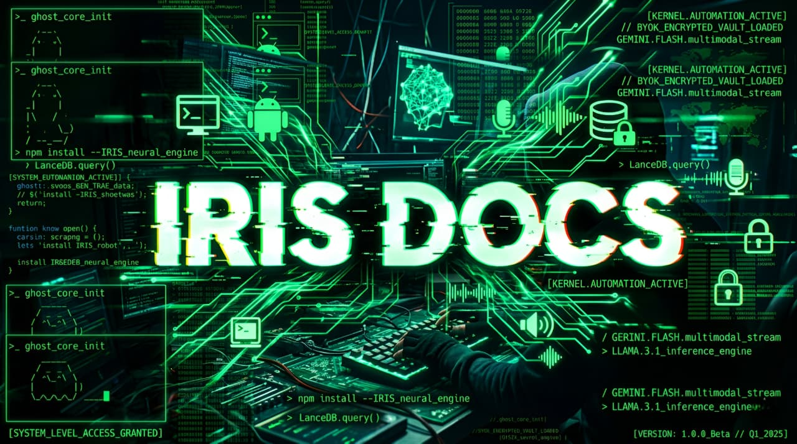

<div align="center">



## The Autonomous Neural OS Agent

<div style="display: flex; justify-center; gap: 10px; margin-bottom: 20px;">
  <a href="https://github.com/201Harsh/IRIS-AI/stargazers">
    
  </a>
  <a href="https://github.com/201Harsh/IRIS-AI/network/members">
    
  </a>
  <a href="https://github.com/201Harsh/IRIS-AI/graphs/contributors">
    
  </a>
  <a href="https://github.com/201Harsh/IRIS-AI/releases">
    
  </a>
</div>

**A local-first neural execution system that turns intent into real OS actions.**

---

</div>

## 📑 Table of Contents

- [⚡ Overview](#-overview)
- [✨ Core Features](#-core-features)
- [🏗️ Architecture](#️-architecture)
- [🔐 Security](#-security)
- [🚀 Installation & Setup](#-installation--setup)
- [📁 Project Structure](#-project-structure)
- [🧠 Development Philosophy](#-development-philosophy)
- [🤝 Contributing](#-contributing)
- [🧩 Extending IRIS](#-extending-iris)
- [🧠 Roadmap](#-roadmap)
- [⚠️ Disclaimer](#️-disclaimer)
- [👨‍💻 Architect](#-architect)
- [📜 License](#-license)

---

## ⚡ Overview

IRIS is not a chatbot.

It is a **local-first AI Operating System layer** that executes real-world actions across your system, applications, and devices.

> Speak your command. IRIS executes it.

---

## ✨ Core Features

- 🧠 Local RAG Oracle (codebase understanding via LanceDB)
- 🖼️ Screen OCR → UI to Code (Gemini Vision)
- 👻 Phantom Typing (global AI injection)
- 📱 Android Control via ADB
- 🌐 Real-time Web Generation (Tailwind + GSAP)
- ⚡ System-level execution engine

---

## 🏗️ Architecture

### Frontend

- React + Tailwind + Framer Motion
- Handles UI, commands, voice

### Backend

- Electron (Node.js)
- Full system access (files, automation, sockets)

### IPC Bridge

```js
window.electron.ipcRenderer.invoke("tool-name", payload);
```

---

## 🔐 Security

- 100% BYOK (Bring Your Own Key)
- Local encryption (OS keychain)
- Zero-trust architecture
- No external key storage

---

## 🚀 Installation & Setup

### 1. Clone Repo

```bash
git clone https://github.com/201Harsh/IRIS-AI.git
cd IRIS-AI
```

### 2. Environment Setup

```bash
cp .env.example .env
```

Add your API keys.

---

### 3. Install Dependencies

```bash
npm install
```

---

### 4. Run Dev Server

```bash
npm run dev
```

---

### 5. Initialize Vault

- Open app
- Go to Command Center (Settings)
- Add API keys securely

---

## 📁 Project Structure

```text
iris/
├── build/                   # OS-specific build artifacts
├── out/                     # Compiled output ready for packaging
├── resources/               # Static assets (icons, trained data, etc.)
├── src/                     # Core application source code
│   ├── main/                # Electron Main Process (Node.js backend & OS execution)
│   ├── preload/             # Context Isolation Scripts (The IPC secure bridge)
│   └── renderer/            # React Frontend (UI, floating widgets, GSAP animations)
├── .env.example             # Template for API keys and environment variables
├── electron-builder.yml     # Configuration for packaging the .exe / .app / .AppImage
├── electron.vite.config.ts  # Vite configuration for the split architecture
├── eng.traineddata          # Tesseract OCR language data file
└── package.json             # Project dependencies and scripts
```

---

## 🧠 Development Philosophy

- Execution > Conversation
- Local-first intelligence
- Modular system design
- Real-world usability

---

## 🤝 Contributing

IRIS is built for the community.

### How to Contribute

1. Fork the repository
2. Create your branch from main
3. Follow existing patterns (Tailwind + IPC typing)
4. Test thoroughly (no blocking main thread)
5. Submit PR with clear explanation

---

### Commit Rules

```bash
✅ git commit -m 'Added new module'
❌ git commit -m "feat: add new module"
```

---

## 🧩 Extending IRIS

You can:

- Add new IPC tools
- Integrate APIs
- Build automation modules
- Extend UI widgets

---

## 🧠 Roadmap

- [ ] Voice-first system
- [ ] Plugin marketplace
- [ ] Memory graph
- [ ] Multi-agent system
- [ ] Desktop + Cloud hybrid

---

## ⚠️ Disclaimer

IRIS has deep system-level execution capabilities.  
Use responsibly. The maintainers are not liable for misuse.

---

## 👨‍💻 Architect

**Harsh Pandey**  
AI Systems Engineer

Instagram: [@201Harshs](https://www.instagram.com/201harshs/)
GitHub: [@201Harsh](https://github.com/201Harsh)

---

## 📜 License

MIT License — see LICENSE file.
[](LICENSE)

---

<div align="center">

# IRIS is not just AI. It's execution.

</div>
